# dispatch-taint システム解説

> 版 8092345c（`tool_version` combined = `8092345c3e549188`）／ commit d16d060 時点。
> 本書は `taintp2x_extension/` と `taintp2x_m2_verification/` のコードを一次情報として、6 サブシステムの読解ノートと 3 文書（README.md, docs/SCALE_OUT_DESIGN.md, RESEARCH_DIRECTION.md）を突き合わせて記述する。数値はすべてノート・文書・`benchmark_out/summary.md` の実測に由来し、コードは `file.py:行 関数名()` で参照する（行番号はドリフトし得るため関数名を併記）。確証の取れない点は【要確認】と明記する。

パス略記（本書内で使用）:

| 略記 | 実パス |
|---|---|
| EXT | `dispatch-taint-system/dispatch-taint/taintp2x_extension` |
| M2 | `dispatch-taint-system/dispatch-taint/taintp2x_m2_verification` |
| EW | `EXT/engine_walls.py`（全 2215 行） |
| L | `EXT/links.py`（全 1188 行） |
| DL | `EXT/dispatch_lowering.py`（全 1395 行） |
| PL | `EXT/pipeline.py`（全 668 行） |
| TV | `EXT/toolver.py`（全 63 行） |
| SH | `M2/run_ablation.sh`（全 221 行） |
| AH | `M2/ablation_helpers.py`（全 591 行） |
| RB | `EXT/run_benchmark.py`（全 1241 行） |
| BJ | `EXT/benchmark.json`（全 404 行） |
| SE | `EXT/subset_extractor.py`（全 349 行） |

---

## 1. 概要と問題設定

### 1.1 何を解こうとしているか

LLM エージェントのコードは、ツールの呼び出し先を「実行時に」決める。典型は次の 3 形である。

```python
# (a) レジストリ添字     REG[name](args)           # name は LLM 出力
# (b) 選択解決 + 呼び出し  fn = self._get_command(k); fn(args)
# (c) ディスパッチメソッド tool.run(args)            # BaseTool.run が _run へ委譲
```

Pysa / TaintP2X のような静的 taint 解析は、こうした呼び出し点で「どの本体へ実行が進むか」を型情報から名指しできないと、その先へ taint を運べずに解析が止まる。この「呼び出し点で taint 伝播が止まる位置」を本システムは**壁（wall）**と呼ぶ。LLM が出力した文字列がシェルや SQL に届く RCE / SQLi / SSRF のフローは、まさにこの壁の向こう側で起きるため、壁を越えられないと検出漏れになる。

### 1.2 方針: 無改変エンジン + 前処理パス

本システム（dispatch-taint）は **taint エンジン（Pysa / TaintP2X）を一切改変しない**。代わりに、壁を「普通の呼び出しコードに書き下す（lowering）」前処理パスを与え、無改変エンジンにその書き下し後のコード（cond_B）を解析させる。taint の定義・source/sink 宣言・解析設定は cond_A（前処理なし）と cond_B（前処理あり）で同一に保ち、両者の差は挿入したコードだけにする。差分（新規に到達した sink 組）が本手法の効果である。

書き下しは実行不能なガードブロックへ挿入する。

```python
if __ctaudit_unreachable__:  # [ctaudit] resolved dynamic dispatch -> N targets | wall=<file>:<line>
    ...            # 壁が名指せなかった宛先への「普通の呼び出し」
```

`__ctaudit_unreachable__` は未定義名であり、実行時には決して真にならない（cond_B を実行すると `NameError`）。しかし Pyre はこの名前が偽であることを証明できないため、ブロック内を解析対象にする。`if False:` だと dead-code として刈られてしまうため、この「不透明ガード」が要点である（DL:6-11 のモジュール docstring、README.md:107-111）。

### 1.3 設計参照: IccTA との対応

設計の下敷きは **IccTA（Li et al., ICSE 2015）**。Android の Inter-Component Communication（ICC）で、Intent による実行時の component 遷移を FlowDroid が辿れない問題を、外部リンク解析（IC3/Epicc）が名指したリンクを Jimple コードとして計装し、無改変の FlowDroid に辿らせて解いた。本手法はこの構図を Python/Pysa に移した「言語レベルの動的ディスパッチ版」である。

#### 同型（構造が対応するもの）

| IccTA | 本手法 | コード |
|---|---|---|
| `ICCLink` 行 | `DispatchLink`（`links.json` に判定付きで永続化） | L:213 `class DispatchLink` |
| `ICCLinksProvider`（Epicc/IC3 DB・設定ファイル） | `AutoLinksProvider` / `FileLinksProvider` | PL:251 / PL:311 |
| `UnreasonableLinksRemover` | 引数互換フィルタ `filter_unreasonable` | L:502 `arg_compat_reason()` |
| explicit-Intent リンク（`ICCLinker`） | レジストリ / BoolOp メンバー narrowing（`narrow`） | L:1030-1041 build_links |
| `INTENT_MATCH_LEVEL`（1<2<3） | `match_level`（1=registry member < 2=decorator/registration < 3=scan-all） | L:78 Candidate |
| `IpcSC.redirectorN` + `ICCInstrumentSource` | `emit="redirector"`: `__ctaudit_redirect.redirector_N(...)` | DL:1063 RedirectModuleBuilder |
| AssignStmt ケース | writeback `x = __ctaudit_ret` | DL:1258-1266 |
| `JimpleIndexNumberTag` / `copyTags` | `wall=<src_root相対 file>:<cond_A line>` ヘッダタグ + リンク id コメント + `lowered_line` | DL:1217, PL:558 _remap_lowered_lines |
| `InfoStatistic` | `LoweringStats`（`stats.json`） | L:240 |
| `updateJimpleForICC` の pass 順 | `LoweringPipeline` | PL:377 run() |
| `NoCodeElimination` + `fuzzyMe()` | `if __ctaudit_unreachable__:` | DL:345 GUARD_NAME |

#### 意図的な相違（審査で問われる点）

| 論点 | IccTA | 本手法 | 根拠 |
|---|---|---|---|
| リンク発見と計装位置 | 外部の値解析（IC3/Epicc）が名指した文を **`IPCMethods.txt` の約 30 署名**で限定して計装 | **外部リンク解析を持たない。一次カタログは「エンジン自身の未解決/解決記録」（S1/S2/S3）** | EW:3-11 docstring、README.md:142-153（`IPCMethods.txt` 実物は 34 行中 30 行、release/res 写しは 25 行） |
| 計装する側 | 両側（宛先に `<init>(Intent)`・`getIntent()` override・lifecycle `dummyMain`） | **呼び出し側のみ**。クラス宛先は `Cls.__new__(Cls)`（`__init__` 未実行）で構築し、**引数運搬 taint だけが壁を越える** | README.md:162-167、DL:1039 `_receiver_stmt()` |
| 到達可能性 | redirect は無条件・常時実行、元 ICC 文は削除 | 元の呼び出しは残し、挿入呼び出しは opaque guard 下（解析効果は同じだが実行パスでない） | README.md:168-172 |
| 多段チェーン | 全リンクを前もって解決し 1 パス | 第 2 ホップの壁は第 1 ホップ挿入後に初めて見える（`__ctaudit_ret` を読む）ため逐次 `stages` | README.md:173-186、PL:462-478 |
| 対応物なし | Android lifecycle モデル、`setResult`→`onActivityResult`、MySQL リンクストア | — | README.md:186-188 |

本手法の独自性は「一次カタログがエンジン自身の解決結果である」点にある。Android ICC が API レベルの現象なのに対し、Python の動的ディスパッチは言語レベルで、外部リンク解析が存在しない。少数の dispatch 行（後述の 17 行）とレジストリ・アンカリング（explicit-Intent 相当のロングテール補完、値解析ではない）が `IPCMethods.txt` の役を担う（SOD:157-167）。

---

## 2. 全体アーキテクチャ

一巡は「cond_A 解析 → 壁発見 → 草案 →（レビュー）→ lowering → cond_B 解析 → 差分測定」。cond_A は前処理なしのホスト単独解析、cond_B は壁を書き下したコピー。両者の唯一の差が挿入コードである（SH:2-13）。

```mermaid
flowchart TD
    subgraph A["cond_A（前処理なし）"]
      A0["TARGET_SRC（解析対象サブセット）+ PYSA_MODELS（.pysa source 宣言）"]
      A1["cond_A/src, cond_A/source を用意<br/>.pyre_configuration 生成<br/>(ablation_helpers config)"]
      A2["pyre analyze --save-results-to ./r<br/>= call-graph / higher-order / taint-output / override-graph ..."]
      A0 --> A1 --> A2
    end

    subgraph D["壁発見 + 草案（draft.py, 変更を書かない）"]
      D1["engine_walls.scan(cond_A)<br/>S1/S2/S3 分類・T1/T2/T3 帰属・env_gap 分離"]
      D2["anchoring(run_src, engine=res)<br/>registry アンカー join（explicit-Intent 相当）"]
      D3["catalog.detect / framework_of / dispatch_rows<br/>= spec.presets.json（17 dispatch 行）"]
      D4["derive_spec: キーごと provenance 付き LoweringSpec"]
      D5["pipeline dry run（write=False, emit=redirector）<br/>fan-out 降格・候補診断"]
      D6["plan.json v2 + review bundle<br/>(walls.md / report.md / plan.draft.json 0444 / ...)"]
      A2 --> D1 --> D2 --> D3 --> D4 --> D5 --> D6
    end

    R{"レビュー<br/>plan.json を編集<br/>accept 反転・spec 追記<br/>review.minutes を記入"}
    D6 --> R
    R -->|"--accept-draft で無人自動許可"| L
    R -->|"人手レビュー後"| L

    subgraph L["lowering（cond_B 構築）"]
      L1["cond_B = cond_A のコピー、r/ 削除"]
      L2["pipeline.run_plan(src_root, plan, emit, write=True)<br/>build_links → lower_wall_file_ex<br/>ガードブロック挿入・links.json / stats.json 出力"]
      L3["diff -rq cond_A/src cond_B/src<br/>= 壁ファイル + __ctaudit_redirect.py のみ差分"]
      D6 --> L1 --> L2 --> L3
    end

    subgraph B["cond_B 解析 + 差分測定"]
      B1["pyre analyze（cond_B, 同一設定）"]
      B2["ablation_helpers count / table<br/>issue 数 A/B/delta・sink 組 A/B・new/lost"]
      B3["engine_walls.residual(cond_B, links.json)<br/>raw / net / confirmed / unlowerable"]
      B4["ablation_helpers row → row.json（1 対象 = 1 行）"]
      L3 --> B1 --> B2 --> B3 --> B4
    end

    B4 --> AGG["run_benchmark aggregate<br/>work/*/row.json → summary.jsonl / .csv / .md"]
```



成果物の流れ（誰が何を書き、誰が読むか）:

- `engine_walls.scan` → `env_report.json`（env）・walls 行 → `draft.build_plan` が読む。
- `draft.build_plan` → `plan.json`（レビュー本体, 編集可）+ `plan.draft.json`（0444 の読み取り専用原本）+ `walls.md` / `report.md` / `anchors.json` / `candidates.draft.json` / `links.draft.json` / `spec.draft.json` / `wall_files.txt` / `env_report.json`。
- `pipeline.run_plan` → 書き換え後の `cond_B/src` + `links.json`（+ `tool_version`）+ `stats.json`。
- `ablation_helpers row` → `row.json`（1 対象）。`run_benchmark aggregate` → `summary.{jsonl,csv,md}`。
- ベンチマークランナー `run_benchmark` は各対象の進行を `state.json` に記録し、`fetch→env→draft→（レビュー門）→condB→row` を再開可能に駆動する。

---

## 3. 用語と定義（実装準拠）

### 壁（wall）
in-repo の呼び出し位置のうち、無改変エンジンが (i) 呼び出し先を名指しできない（S1）、または (ii) 名指しはするが本体へ taint を運べない（S2 stub/obscure、S3 dispatch メソッド）位置。**到達条件（tier）は壁の定義に含めない**（README.md:216-218、EW:15-39）。「AST が壁に見える」ではなく「エンジンがそこで taint を失う」が定義（SOD:39-41。反例: typed dict による `method_wall` fixture は lowering 無しでも検出されていた——EW:40-41 の教訓）。

### S1 / S2 / S3

| 区分 | engine_status | 意味 | コード |
|---|---|---|---|
| S1 | `unresolved:<reason>` | `call-graph.json` が callee を未解決記録 | EW:1451-1454, 1585-1622 |
| S2 | `resolved_stub` / `resolved_obscure` | 名指すが本体へ taint を運べない（trivial 本体 or Obscure モデル）。**動的受け手のときのみ** | EW:1493-1568 |
| S3 | `resolved_dispatch:<api>` | フレームワークの dispatch メソッドへの解決（カタログ行一致 or HO 記録の転送） | EW:1455-1491 |

- S1 の `<reason>`（Pysa 7873fbf / pyre-check 0.9.25 の経験的語彙、EW:101-111 `UNRESOLVED_REASONS`）は kind へ写像される: **dispatch**（`UnknownIdentifierCallee` / `UnknownCallCallee` / `NonMethodAttribute`）・**receiver**（`UnknownBaseType`）・**env**（`CannotResolveExports` / `CannotFindParentClass` / `CannotFindAttribute`——ディスパッチ壁ではなく環境ギャップ）・**other**（`LambdaArgument`, `n/a`）。
- S2 の候補集合は**受け手の静的型で絞った CHA 宛先集合**（review C5）: `receiver_class` とその推移的サブクラス（`override-graph.json` + 木内 `ClassDef` 基底）に属する override のみ（EW:1510-1543）。`s2_reason` の値:
  - `receiver_subclasses`——具象サブクラスの override を宛先に持つ。
  - `receiver_subclass_no_overrides`——受け手の型で絞ると宛先が構成上ゼロ。abstract stub（`@abstractmethod` / `NotImplementedError` raise。EW:1030-1044 `_stub_kind`）なら**unlowerable な壁**（`resolved_stub`, 候補 0, `proposed`, `accept=false`, `residual_unlowerable` に計上）、empty stub（`pass` / `...` / docstring のみ / それ以外の raise）を具象の葉で呼ぶなら壁でない（`status="resolved"`）。
  - `receiver_unknown`——`typing.Protocol` 受け手など。override 行は構成上存在せず候補はデコレータ/アンカー回収から来るため**事前 accept のまま**（unlowerable 規則を広げない、EW:1518-1527, 1780-1783）。
- S3 は型付き木ではエンジン自身が override 集合を辿るため `proposed`（事前 accept しない）。型消去時や本体が木外/Obscure のとき実の壁になる（EW:1473-1491）。

### taint 層 T1 / T2 / T3（報告のみ、門にしない）
`tier_of`（EW:1393-1407）。T1 = **モデルの `sources` / `parameter_sources` 位置**がその呼び出し行範囲に触れる（tito/sink 要約の位置は数えない）、T2 = 囲む callable が source を持つ（`_source_reach`、EW:1286-1327）、T3 = source から BFS で到達可能。`none` = 現成果物上、source 由来 taint がこの callable に届いた証拠がない。**採否の門ではなく報告のみで、行を並べ替えるだけ**（EW:43-52, 1653-1654）。理由: `.pysa` を書く前は T1/T2 が空（循環）で、門にするとフレームワーク規模で何も出ない。T3 は抜粋（extract）では呼び出し元記録が無く再現不能なため、`r/engine-tiers.json` サイドカーから供給する（EW:1388-1391）。

### sink 組（sink pair）
`(sink kind, issue の callable)`（`SINK_PAIRS`、AH:179-192 `_sink_pairs`、契約 K5）。Pysa は sink 呼び出しへの tainted 引数 1 本ごとに 1 issue を報告するため、raw issue 数より粗く安定した測度。旧鍵 `(sink kind, first hop)`（backward trace 根の `resolves_to` 先頭、`SINK_FIRST_HOPS`, AH:195-210）は**診断専用**——sink メソッドでもなく、解決集合が縮むと不安定。ただし **AutoGPT 回帰の門 `EXPECT_SINKS_B=5` はこの旧鍵で定義**される（SH:69-72, 214-220）。

### residual（残差）
cond_B に残った壁を、生成ブロック（`if __ctaudit_unreachable__:`）と生成 redirector モジュール内を除外し（status `generated`）、cond_B 行を生成 span 経由で cond_A 行へ逆写像した後で数える（EW:1848-1940 `residual()`、review C1）。

| 鍵 | 意味 |
|---|---|
| `residual_raw` | `engine_tier ∈ {T1,T2}` かつ status が `unresolved:*` / `resolved_stub` / `resolved_obscure` の壁数 |
| `residual`（net） | raw から lowered 済みリンク分（`links.json` の `status=="lowered"`）を差し引いた数 |
| `residual_confirmed` | net のうち `confidence=="confirmed"`——原理的に lowerable なのに残った壁（草案が事前 accept した idiom の部分集合） |
| `residual_unlowerable` | net のうち `s2_reason=="receiver_subclass_no_overrides"`——木内実装の無い abstract stub、構成上リンク不能 |
| `lowered_walls` / `generated_excluded` / `remapped` / `legacy_links` | 補助（`legacy_links`=pre-C1 basename 鍵 links.json） |

**読み方**: `residual_net − residual_unlowerable` = lowering できたはずなのに残った壁、`residual_confirmed` = そのうち confirmed idiom の部分集合（README.md:265-267）。proposed 行（定数キーの inline subscript 受け手など）も net に数える——accepted 相当は `residual_confirmed`（RD:1137）。

### outcome（11 値の語彙）
`classify_outcome`（AH:388-416, 純関数）が返す公開判定。

| outcome | 条件 |
|---|---|
| `env_failed` | lowering 後に taint-output.json 無し、または cond_A 結果無し |
| `no_sources` | in-repo source model 0 等（source が届かない） |
| `no_surface` | 壁の面がゼロ |
| `catalog_stale` | 帰属 FW の dispatch API が in-repo に無い（draft のみ） |
| `no_walls` | 草案が accept 0 |
| `no_candidates` | accept>0 かつ `links_lowered==0`（sub-reason: `no_links` / `<status>_majority` / `mixed`） |
| `drafted` | cond_B 未構築 |
| `delta_pos` | 新規 sink 組>0 かつ消失 0 |
| `delta_mixed` | 新規>0 かつ消失>0 |
| `delta_neg` | 新規 0 かつ消失>0 |
| `delta0` | 差分なし |

`measured = lowering_ran and links_lowered>0` のとき測定結果が draft 判定を上書きするが、`run_benchmark._table_outcome`（RB:883-898）は表では環境判定（`no_sources`/`no_surface`/`catalog_stale`）を空虚な `0→0` の delta0 より優先する。cond_B の pyre timeout は `env_failed` であって「issues=0」ではない（review M5）。

### closed アンカー（registry anchoring）
コールサイトが自分の宛先集合を名指すソース可視のレジストリ（IccTA の explicit Intent 相当）。`Anchor.closed`（anchoring.py:158-160）= `not open and bool(members) and all(m.kind != "unknown")`。閉じる条件は実装が確認するものだけ（review C6）: 全メンバーが可視の def/class/instance、モジュールレベルで 1 回だけ束縛されどのスコープでも変更なし（`NAME[k]=v` / `del` / `.update` 等 / `+=`・`|=` / `global`+代入 / エイリアス経由も）、`Cls.attr` はさらに `self.attr=<実行時値>` なし・クラス本体/木内基底の同名宣言なし・サブクラスの束縛なし。鍵はモジュール修飾（`pkg.mod.REGISTRY` / `pkg.mod.Cls.attr`）。サブクラスからの `self.attr` 読みは **inherited 読み**（候補追加のみ、narrowing/confirmed しない）。

### カタログ / catalog_stale / impl map
`spec.presets.json` = **1 ファイル・17 の dispatch 行**（`IPCMethods.txt` の analogue）。`catalog.top_preset`（catalog.py:153）= 草案が回収キーを種にするプリセット（import か判別力ある基底クラスの証拠。デコレータ単独では選ばない）。`catalog.framework_of`（catalog.py:183）= 表の帰属 FW（種プリセットのスコアが `match.min_score`、既定 `FW_MIN_SCORE=20`（catalog.py:53）以上のときのみ、未満は `(none)`）。`catalog_stale`（catalog.py:316 `stale()`）= 帰属 FW の dispatch API が in-repo callable に無い（venv=解析検索パスにだけある行は別報告し、それでも stale——review M4）。`dispatch_impl_map`（`catalog.impl_map_for`, catalog.py:203）= active FW のカタログ行のみから作り空でも書く（review M10/K7）。

### idiom（呼び出しの語彙、`describe_call` / `_idiom_of`）
壁がどう callee を選ぶかの分類（EW:912, L:772）。dispatch 系（`_DISPATCH_IDIOMS`, 呼び出し点自体で選択、pre-accept 対象）と deferred 系（`_DEFERRED_IDIOMS`, 候補が呼び出し元/反復コレクション由来、anchoring 待ち）に分かれる。

| idiom | 形 | 区分 |
|---|---|---|
| `subscript` | `REG[k](...)` | dispatch |
| `getattr` | `getattr(o, k)(...)` | dispatch |
| `boolop` | `fn = PRIMARY or default; fn(...)` | dispatch |
| `higher_order` | `f = resolve(k); f(...)` | dispatch |
| `method_call` | `t.run(...)`（インラインレシーバ含む） | dispatch |
| `attr_call` | `self.handler(...)`（callable 値属性） | dispatch |
| `param_call` | パラメータで渡された callable の呼び出し | deferred |
| `loop_call` | `for h in handlers: h(...)` | deferred |
| `call_call` | `factory()(...)` | deferred |

### `EngineWall`（EW:218-258）
壁 1 件の全記録: `id / file(src_root 相対) / line / col / callable(囲む callable) / callee(unparse) / idiom / resolver / key_expr / receiver_binding / members / members_open / engine_status / engine_reason / engine_targets / dispatch_targets / receiver_class / target_form(plain|overrides|"") / s2_reason / engine_tier(T1|T2|T3|none) / origin="engine" / confidence(confirmed|proposed) / accept / note / stmt_line / stmt_kind / in_async / taint_args / aligned / callable_match`。`position` = `file:line:col`。

### cond_A / cond_B
cond_A = ホスト（Pysa/TaintP2X）単独の解析ツリー（前処理なし）。cond_B = cond_A のコピーに壁を書き下したツリー。両者の差は lowering 挿入のみ（SH:2-13）。

### tool_version（ツールフィンガープリント）
`toolver.tool_version()`（TV:39-51）が返す `{"files": {basename: sha256}, "combined": sha256}`。TRACKED（TV:17-28, この順）: EXT の `engine_walls.py, links.py, draft.py, anchoring.py, catalog.py, pipeline.py, dispatch_lowering.py, spec.presets.json` + M2 の `ablation_helpers.py, run_ablation.sh`。combined は各行 `"<basename>=<sha>\n"` を連結した sha256。現行値 `8092345c3e549188`（先頭 16 桁）。plan / row / ablation / state 全てに刻印し、`same_version`（TV:54-58）で別版の混入を検出する（review C7/K4）。

---

## 4. コンポーネント詳細

### 4.1 `engine_walls.py`（EW）— エンジン駆動の壁発見

役割: cond_A の Pysa 成果物だけを読み（追加の pyre 実行なし・「壁に見える」AST ヒューリスティクスなし）、壁を S1/S2/S3 に分類し、T1/T2/T3 を帰属し、env gap を分離する。壁発見の一次カタログをエンジン自身の unresolved-call 記録とする点が IccTA との相違（EW:1-67 docstring）。

**入力（読む Pysa 成果物、`<cond>/r` 下）** `EngineRun`（EW:288-513）:

| 成果物 | 寄与 | 参照 |
|---|---|---|
| `call-graph.json` | S1 の未解決理由、解決ターゲット（`Overrides{}` 含む）、`receiver_class`、位置キー。旧 `singleton`/`compound` と新フラット schema 両対応 | EW:164-178 `_iter_call_objs`, 383-402 |
| `higher-order-call-graph.json` | S3 の HO 証拠（`higher_order_parameters[].calls[].target` が `Overrides{}` に一致するもののみ dispatch 先） | EW:1359-1371 `ho_dispatch_targets` |
| `taint-output.json` | S2 の Obscure 判定、T1/T2 の source 位置、issue/model 統計 | EW:423-448 |
| `modules.json` / `functions.json` / `decorator-counts.json` | モジュール↔ファイル対応、`catalog_status` 判定、`decorators_in_repo` | EW:450-475 |
| `override-graph.json` | S2 候補集合、`Overrides{}` 展開、`_ClassHierarchy` の親子 | EW:477-484 |
| `taint-metadata.json` / `errors.json` | `pysa_version`（既知版 `7873fbf...`, EW:92 と照合）、`model_verification_errors`、`issues_cond` | EW:499-513 |
| `engine-tiers.json`（`TIER_SIDECAR`, EW:95） | **extract 抜粋専用**の T2/T3 サイドカー（実 cond dir には無い） | EW:486-497, 1388-1391 |

**source-dir 規則と `in_repo_rel`**（EW:291-366）: `.pyre_configuration` の `source_directories` を cond_dir 相対に変換し `src_root = cond_dir/source_dirs[0]`。`in_repo_rel(filename, path)`（EW:339-366）はレコードが source dir 内にあるときの cond 相対パスを返す。`filename=="*"`（他所で解析して `r/` を移動したコピー）では「全 cond 相対パスがサフィックスであること」を要求し、bare basename 一致で site-packages を引き込まない。

**主要関数/クラス**:
- `describe_call(call, fx)`（EW:912-992）——idiom / resolver / key_expr / receiver_binding / members / members_open を返す AST 記述。`_binding_of`（EW:813-859）で名前束縛を追い、内包表記の後方参照が束縛を壊さないよう位置規則を持つ（review M1）。インラインレシーバ（`REG[k].run()`, `getattr(o,k).m()`, `(a or b).m()`）も method_call の壁として扱う（EW:974-986）。
- `scan(cond_dir, ...)`（EW:1330）——site を走査し S1/S2/S3 に分類、kind 補正（receiver-binding 規則で env へ落とす等、EW:1585-1616）、env gap を分離、`EngineWall` を出力。artificial-call と constructor は最初から除外（EW:1432-1433）。
- `residual(cond_b, links_json, ...)`（EW:1848）——上記「residual」定義の計算。
- `extract(cond, out, files, ...)`（EW:2025）——テスト用の最小 committable `r/`（`build_tier_sidecar` で `engine-tiers.json` も生成）。
- `dataset_scan(call_graph, ...)`（EW:1946）——木なしの call-graph.json に対するカウント専用パス（TaintP2X データセット、旧 schema）。「そもそも表面があるか」に答える。
- `load_catalog(path)`（EW:1232）——既定 `EXT/spec.presets.json`。`FALLBACK_DISPATCH`（EW:131-134）はファイルが**存在しないときのみ**（存在してパース失敗なら空カタログになる——【要確認】 EW:1238-1256 の制御フロー上の帰結だが docstring EW:1234 は「missing のときのみ」と明言）。

**scan 内での kind 補正**（EW:1585-1616）——未解決理由から得た kind を idiom と receiver_binding で修正し、環境ギャップを壁から分離する:

1. kind receiver かつ receiver_binding ∉ `_RECEIVER_DISPATCH_BINDINGS` → `env`（型ギャップであって選択でない）。
2. kind dispatch + idiom `name_call` + receiver_binding あり → `env`（import/def/class の静的束縛をエンジンが型付けできない = import ギャップ）。ただし**束縛が全く見えない Name（star import、他所で代入されたグローバル）は proposed/review 行のまま残す**（review M1）。
3. kind dispatch + idiom `param_call` + 呼び先が `cls`/`self` → `env`（classmethod の `cls(...)`）。
4. kind dispatch + idiom `attr_call` + 理由 ≠ `NonMethodAttribute` + receiver_binding ≠ `"attr"` → `env`（型付け不能な `self.m(...)`）。
5. kind env かつ `--all` でない → 壁行にせず `env_gaps` リストへ（`{file,line,col,reason,callable,callee}`）。

**`_suggest` の受理規則**（EW:1738-1791）: dispatch idiom（`_DISPATCH_IDIOMS`, EW:117）+ 非静的キー → accept/confirmed。定数キー（`_key_is_constant`, EW:995——`ast.Constant` or `__name__`/`__package__`/`__file__`/`__spec__` は静的選択）や `_DEFERRED_IDIOMS`（param_call/loop_call/call_call, 候補が callers/反復コレクション由来で anchoring 待ち）は off/proposed。receiver 束縛が `_RECEIVER_DISPATCH_BINDINGS`（subscript/getattr/boolop）+ 非静的キー → confirmed。BoolOp レシーバは「閉じた Name/Attribute のみ・パラメータ選択肢なし」のときだけ confirmed（`x = kwargs.get('k') or {}` は型なし → proposed）。S2 は `receiver_subclass_no_overrides` かつ dispatch_targets 空のみ off、それ以外 confirmed。S3 は catalog 行かつ engine-follows-overrides でない行だけ accept。`aligned`（AST 位置一致）でなければ accept を強制 off。

**generated ブロック / redirector の除外**（EW:551-691, 1436-1450, review C1(b)）: lowering が挿入した `if __ctaudit_unreachable__:` ブロック（`_GUARD_TAG_RE`, EW:551）と、docstring が `[ctaudit] generated redirectors`（`GENERATED_MODULE_DOC`, EW:552）で始まる redirector モジュールは丸ごと generated 扱い。`_FileIndex._walk` は中を歩かず、scan は site 行が generated span 内なら `counts["generated"]` を増やし status `"generated"` で記録して**壁にも env gap にも数えない**。`cond_a_line`（EW:603-614, review C1(c)）が cond_B 行を生成 span 分だけ差し引いて cond_A 行へ写像する。`residual()` はこの写像で lowered 済み壁をネットする。

**カタログ presence の 2 ビュー**（review M4, EW:1682-1690）: `catalog_status`（in-repo 版、`stale()` が読む）= api に一致する functions.json 名の最長モジュール接頭辞が in-repo ファイルへ写像されるとき `present`; `catalog_status_search_path` = venv 含む検索パスに 1 つでも一致で `present`。venv 入りフレームワークがカタログを stale にしないための区別。

**outcome 判定**（EW:1692-1700）: `no_sources`（source_models==0 等）/ `no_surface`（壁ゼロ）/ `no_walls`（accept 壁ゼロ）/ `ok`。

**CLI**（EW:2146-2215）: `scan <cond> [--src][--out][--catalog][--all][--disable S1,S2,S3][--json]` / `dataset-scan` / `residual <cond_b> [--links]` / `extract <cond> --out --files...`。exit code: outcome ok→0, no_surface→2, no_sources→4, no_walls→5, その他→1。ablation `--disable`（EW:1330-1333）は S1/S2/S3 の leave-one-out（該当クラスを `resolved` 扱い）。

### 4.2 `toolver.py`（TV）— ツールフィンガープリント

役割: plan / row / ablation に「それを作ったコード+カタログ」の sha256 を記録し、`aggregate` が別版の行を黙って混ぜず警告できるようにする（TV:1-6）。`tool_version()`（TV:39）/ `same_version(a,b)`（TV:54）。`python3 toolver.py` 単体で JSON 出力（TV:61-63）。

### 4.3 `links.py`（L）— リンク IR

役割: IC3/Epicc の `ICCLink` 表に相当。壁と解決先候補の対応（`DispatchLink`）と、そのフィルタ判定を IR として保持・永続化する。

**`Candidate`**（L:59-137）: 解決先候補。フィールドは `cls / name / params / kwonly / has_varargs / has_kwargs / module / path / lineno / is_async / decorated / origin(decorator|registration|base_class|scan_all|explicit|boolop_member|anchor) / match_level(1/2/3) / forward / evidence / importable`。`decorated`（署名保存デコレータ集合 `_SIGNATURE_PRESERVING_DECORATORS`, L:39 に含まれないデコレータが 1 つでも付く）は署名不明扱いにする。

**`WallRecord`**（L:173-210）: 壁の全記録。`id / file(src_root 相対 POSIX) / line / col / idiom / callee / registry / members / assign_target / is_method_wall / taint_args / status(resolved|skipped_no_args|unresolved|rejected_by_review|unmatched_position) / engine_status / engine_tier / origin(ast|engine|anchor:<name>|catalog:<FW>:<API>|review) / confidence / lowered_line(cond_B 座標)`。壁のアーティファクト横断同一性は `(file, line, col)`（basename 禁止, review C1）。

**`DispatchLink`**（L:213-237）: `id / wall_id / file / line / target(Candidate) / match_level / col / status(lowered|filtered_registry|filtered_level|unreasonable|no_args|phantom) / reason / taint_args / redirector / lowered_line`。`args_for(wall) = taint_args or target.forward or wall.taint_args`。

**`build_links`**（L:877-1144）: フィルタパイプライン。各判定は必ずリンク行として記録され黙って落とさない。順序:
1. レビュー却下（`reject_walls` / `accept:False`）→ `rejected_by_review`。
2. BoolOp メンバー候補・アンカー候補の追加。
3. narrowing 選択（BoolOp members > anchor_names > registry index）。
4. 候補ループ: メソッド名整合 → base_class 裸呼び規則 → S2 関数候補除外 → importable → narrowing 所属（含めば `match_level=1` へ昇格、外れれば `filtered_registry`）→ 引数互換（`arg_compat_reason`）→ match_level キャップ → 引数なし → 通過 `lowered`。

**`arg_compat_reason` と `forward_args`**（L:502-598, IccTA の Intent 配送を署名対応化）: `arg_compat_reason`（L:502）は recall-first——`cand.forward` あり / `is_method_wall`（引数は標的の署名でなくディスパッチメソッドのもの）/ 署名未知 / `origin=="base_class"` はスキップして `""` を返しリンク維持。チェックは「位置引数が params 数を超え varargs なし」と「`**kwargs` なしで未知キーワード」のみ。`forward_args`（L:536）は (1) `cand.forward` 最優先 (2) 壁の単純/リテラル位置引数を逐語転送、転送不能な位置引数が現れたら以降はキーワード渡しか落とす (3) キーワードは accepted か署名未知なら転送 (4) `**d` / `*a` スプラットは壁が埋めなかった全パラメータへ配布（`command(**tool_call.arguments)` → `code=d, filename=d, args=d`）(5) 何も転送できなければ `scope_args`（包含スコープのパラメータ/ローカル）へフォールバック。

**`index_registries`**（L:320-404）: 走査ツリー全体で一度も変異・再束縛・エイリアスされない単一の静的 dict リテラルのみを `name → frozenset(members)` として信頼する。最終フィルタは `k not in untrusted and v and bindings[k]==1`。untrust 理由（全網羅, L:358-401）:

| 理由 | 例 |
|---|---|
| Subscript 代入標的 | `REG[k] = v` |
| タプル/リスト分解標的 | `a, REG = ...` |
| AugAssign | `REG \|= other` |
| dict リテラルでも非対応値 | `{**other}` 展開 / 非文字列キー / Name でも文字列でもない値 |
| 異なるトークン集合の再束縛 | 同名を別 dict で 2 回束縛 |
| dict 以外の値での束縛 | `REG = make()` |
| エイリアス | `r = REG`（REG 側を untrust） |
| del | `del REG` / `del REG[k]` |
| パラメータ遮蔽 | 関数引数が名前を隠す |
| 変異メソッド | `.update / .setdefault / .pop / .popitem / .clear`（`_MUTATORS`） |
| 素の名前で 2 回以上束縛 | 2 モジュールの `REGISTRY` は別オブジェクト（precision を失うが recall は失わない） |

`_iter_py_files`（L:416-466）は realpath + SHA1 内容ハッシュで重複除去（review C4/K6: 壁ツリーと候補ツリーの二重走査で同一 dict を 2 回見て `bindings==2` で untrust する事故の防止）。相対パスだけでのスキップはしない——同じ相対パスで内容が異なる双子は第二定義として正しく untrust させる。

**永続化**: `dump_links`（L:1150）/ `load_links`（L:1169）。`{"walls":[...], "links":[...], "stats":{...}}` + extra（`tool_version`）をトップレベルへマージ。`indent=2, ensure_ascii=False`。手書き links は `walls` 省略可、各リンクは `"line"` 必須。

### 4.4 `dispatch_lowering.py`（DL）— 候補回収・下降・放出

役割: `ICCInstrumentSource` / `IpcSC.redirectorN` に相当。候補を回収し、壁位置を照合し、2 モードでガードブロックを放出する。

**`LoweringSpec`**（DL:92-145）: 全キー。候補回収（`tool_decorators / register_methods / tool_list_names / tool_wrappers / tool_base_classes / tool_impl_methods / wrapper_func_kwargs / registry_vars / scan_all_callables / candidate_import_module / insert_before`）、壁検出（`resolver_hints / wall_method_names / detect_subscript / detect_getattr / detect_higher_order / detect_boolop / wall_param_names / wall_attr_names`）、精度（`narrow / filter_unreasonable / match_level`）、放出（`emit(inline|redirector) / candidate_module_root / candidates`）、レビュー駆動（`wall_positions / reject_walls / wall_files / exclude_paths`）、impl map（`dispatch_impl_map / impl_map_source`）。`wall_positions` 非空なら**それらの位置だけが壁で detect_* は無視**（DL:127-131）。

**候補回収** `collect_candidates`（DL:480-562）: 明示 `candidates` があれば回収をスキップ。デコレータ末尾成分が `tool_decorators` に一致するメソッド（level2）、`scan_all_callables`（level3）、`tool_base_classes × tool_impl_methods`（`origin="base_class"`）、登録イディオム（`_registration_refs`, DL:438——`x.register(fn)` / `f(tools=[...])` / `TOOLS={...}`）。

**放出 2 モード**（DL:1158-1305）:
- inline: ブロック内 import + クラス標的は `__ctaudit_obj = Cls.__new__(Cls)`（`__init__` 未実行で受け手を型付け）→ `__ctaudit_obj.name(args)`、関数標的は `name(args)`。`candidate_import_module` 設定時はファイル先頭に `if TYPE_CHECKING:` import を注入（Pysa が追わない obscure 化を防ぐ）。
- redirector: `__ctaudit_redirect.redirector_N(args)` を呼び、`RedirectModuleBuilder`（DL:1063）が redirector 定義を生成。module 不明の標的は `phantom`。

**挿入位置**（DL:1199-1216）: 包含**文**にアンカー。`before = insert_before or stmt_kind ∈ _BEFORE_KINDS`（DL:1011-1012 の 12 種: Return/Raise/If/While/For/AsyncFor/With/AsyncWith/Try/TryStar/Match/Assert——後は到達不能か本体に落ちる）。`elif` 壁は連鎖先頭 `if` へ（再親化の回避）。挿入後 `lowered_line` を確定（`JimpleIndexNumberTag` 類似）。

**壁マッチング** `_find_walls_positions`（DL:690-732）: `(line,col)` 完全一致 → `_end` 一致 → callee テキスト一致 → 最外 Call。不一致（ドリフト）なら行のみ照合（callee テキスト一致 → wide spec の一般検出 → 行の最初の Call）。生成ブロック（`_is_generated_block`, DL:349 = test が Name `__ctaudit_unreachable__` の If）内へは降りない（自出力の二重下降を防ぐ）。`find_walls_with_scope`（DL:750）は 4 タプル `(walls, chain, unmatched, meta)` を返す。

**impl map**（DL:166-186, review M10/K7）: `DEFAULT_IMPL_MAP`（DL:166）= `run→(_run,)`, `arun→(_arun,)`, `invoke→(_run,run)`, `ainvoke→(_arun,arun)`, `execute→(execute,_execute)`, `call→(call,_fn,__call__)`, `acall→(acall,)`。`impl_map_of`（DL:176）は `impl_map_source=="spec"` なら空マップから開始（DEFAULT を継承しない）、`"default"` なら DEFAULT のコピーから開始。plan 由来 spec は draft.py がカタログ行から明示的に書くため DEFAULT を継承しない。`_coerce_spec`（DL:228）の legacy 判定 = 非メタ新キーが無く旧単数キー（`dispatch_resolver_hint` / `tool_decorator`）があるとき。`impl_map_source` は「`dispatch_impl_map` キーの存在」で `"spec"`（内容ではなくキーの存在で判定, review M10——plan は空でも書く）。

### 4.5 `pipeline.py`（PL）— 実行ドライバ

役割: `AndroidIPCManager.updateJimpleForICC` に相当。プロバイダから候補/リンクを得て、複数ステージ/グループを順に lowering し、行番号を写像・逆写像する。

- プロバイダ: `AutoLinksProvider`（PL:251, クラス変数キャッシュで候補回収を `_recovery_key` 単位にメモ化——ドラフトが壁ファイル毎に 1 グループを dry run する際、50 グループでも走査 1 回。`_extra_registry_roots` が cand_dir 外の壁ファイルにバイト同一双子が無ければレジストリ索引ルートを追加）/ `FileLinksProvider`（PL:311, 保存済み `links.json` を src_root 相対 or 絶対パス一致 or `file==""` で選別、basename 比較なし）。
- `LoweringPipeline.run`（PL:377）: 壁ファイル毎に pre_passes → originals スナップショットと現テキストが異なれば `_line_map` でピンを remap → `lower_wall_file_ex` → `id_offset += max(len(walls), len(links))` → post_passes → `_finish_records`。`_line_map`（PL:123）はパスが行を挿入しかしないため貪欲一致で厳密（ガード行は次の原行と決して等しくない）。
- `run_spec`（PL:439）: `stages` があれば多段（`write=False` かつ複数ステージは `SystemExit("staged specs require writing")`）。`id_prefix` は多段時 `S<i>`。redirect ビルダーは run 全体で 1 個（ステージ毎だと連番が振り直され最終ステージが先行分を上書きするため）。
- `run_plan`（PL:496）: `plan["groups"]` を順に `run_spec`。`id_prefix=G<gi>` → 多段グループは `G<i>S<j>W..`。**originals**（どのグループが書き換える前に全グループの壁ファイルを一度だけスナップショット）。accept 偽かつ stages 無しのグループは `wall_positions` があれば行だけ記録（`rejected_by_review`、統計を正直に保つ）。stats は無条件 merge（review M2: unmatched ピンだけの第1グループが次グループに置換され `walls_unmatched` が消えるバグの修正）。総和にしない量: `files=len(壁パス)`, `candidates_total=max(各ステージ)`, `redirectors=ビルダー count`。
- `_remap_lowered_lines`（PL:558）: 全ステージ/グループ後、lowered リンクは最終テキストの `# {l.id}` タグで再定位、壁の `lowered_line` は originals→最終テキストの `_line_map` で確定。キーは src_root 相対（C1）。
- `write_links`（PL:592）: `dump_links(..., extra={"tool_version": toolver.tool_version()})`（review C7/K4）。`stats.json` = `res.stats.to_dict()`。
- `_finish_records`（PL:175）: 全レコードの `file` を相対パスに（K1）、lowered リンクを持つ壁の `lowered_line` を前方写像（K2）、back があれば壁とリンクの座標を cond_A へ逆写像、この段が放出した `wall=<file>:<line>` ヘッダタグも書き換え。
- CLI（PL:628）: `--src-root`（必須）、`--spec` か `--plan`、`--cand-dir`、`--walls`、`--emit`、`--links-in/-out`、`--stats-out`、`--dry-run`。

### 4.6 `draft.py`（D）— 草案生成

役割: `engine_walls.scan`（壁）+ 導出 spec（キーごと provenance）+ pipeline dry run（`write=False`）を結合し、`plan.json` とレビュー束を書く。**cond_A 配下は一切変更しない**（D:1-31）。

- 定数: `PLAN_VERSION=2`（D:60）、`EXIT={ok:0, no_surface:2, catalog_stale:3, no_sources:4, no_walls:5}`（D:62）、`FANOUT_MAX=16`（D:246, narrowing なしでこれを超える lowered ターゲットは proposed へ降格）。
- `build_plan`（D:329）の流れ: `EW.scan(disable=...)` → `--include-proposed` 反映 → `anchoring` join（`_apply_anchors`）→ unlowerable ガード（`_unlowerable`, D:260）→ `catalog.detect` / `framework_of` → `derive_spec` → グループ化（wall file ごとに 1 group）→ plan dict → `_dry_run` → `_recount` → `_hints` → outcome 再判定（accept 0 で `stale()` なら `catalog_stale`）。
- `derive_spec`（D:128）: 常に `detect_*=False`（壁は wall_positions でピン）、供給順は「ツリー証拠 → 明示 `--preset` → 検出プリセット」。`dispatch_impl_map` は `catalog.impl_map_for(catalog, active)` で active FW のみから作り空でも書く。
- `_entry`（D:280）: `wall_positions` の 1 要素。BoolOp は `match_level=1`、anchored は `anchor_members`/`anchor_closed`、`overrides:<stub>` アンカーは override-graph 由来の members。
- `_apply_anchors`（D:433）: `(file,line,col)` でエンジン行と join。未 accept で `idiom ∈ (loop_call, param_call, method_call)`・per-read closed・candidates あり・engine_status が unresolved/stub/obscure → `accept=True, confidence="confirmed"`（note「promoted by the anchor's members」）。エンジンが列挙しなかった読みは新規行（`id="A<n>"`, `origin=f"anchor:{a.name}"`）。
- `_demote_fanout`（D:536）: accepted かつ `dry_run.lowered > FANOUT_MAX` かつ level-1 lowered ターゲット無し かつ bounded でない → proposed 降格。bounded 例外は `idiom ∈ (method_call, attr_call)` かつ属性名が `dispatch_impl_map` のキー（登録ツール集合そのもの）。降格があった group は demoted 行を off にして 2 回目の dry run（stats は plan が実際に lower する分のみ）。
- `_hints`（D:625）: `stage2`（lowered ターゲット自身が壁を含む——2 ホップ目候補）/ `no_candidates`（accept 行で links==0）/ `phantom`（module 不明・nested def）/ `fan_out`（`lowered>8` の注意喚起、降格閾値 16 とは別）/ `unlowerable`（abstract stub の残余）/ `env`（`CannotResolveExports` / `model_verification_errors` 件数）/ `catalog`（build_plan 側で追加）。
- `render_walls_md`（D:674）: 12 列テーブル（`# / position / callee / idiom / resolver[key] / engine / tier / origin / conf / fan-out / accept / note`）。`render_report_md`（D:698）: outcome・exit、plan version/tool_version、spec キー+provenance、dry run 明細、anchors、カタログの 2 ビュー（ツリー内定義 / 検索パス上）、hints、next コマンド。
- `write_bundle`（D:783）: `plan.json`（編集本体）、`plan.draft.json`（**0444 読み取り専用原本**, review C7）、`walls.md`, `report.md`, `env_report.json`, `spec.draft.json`, `wall_files.txt`（accepted のある group の wall file のみ）, `candidates.draft.json`, `anchors.json`, `links.draft.json`。`main`（D:818）の戻り値 = `EXIT.get(plan["outcome"], 1)`。

### 4.7 `catalog.py`（C）— 本システムの `IPCMethods.txt`

役割: 各フレームワークの dispatch 行を `spec.presets.json` に保持し、ツリーがどの FW を使うかを検出（imports / base_classes / decorators）、帰属と staleness を判定する。

- `detect()`（C:94-150）: スコア式 `Σimports + 5*Σbase_classes + 3*Σdecorators`（match ブロック列挙名のヒットのみ）。相対 import はスキップ（同胞モジュールで FW 証拠にならない, review M4）。
- `top_preset()`（C:153）: imports ヒットのあるプリセット優先、無ければ判別力ある base class、decorator 単独は決してシードしない。
- `framework_of()`（C:183）/ `FW_MIN_SCORE=20`（C:53）/ `min_score_of`（C:174）。
- `impl_map_for(rows, active)`（C:203）/ `active_frameworks`（C:221）/ `impl_map_stale`（C:236）。
- `stale()`（C:316）: 帰属 FW の dispatch API が in-repo に無いとき理由を列挙。`merge_status`（C:274）で in-repo と search-path の 2 ビューを統合。

### 4.8 `spec.presets.json` — プリセット 11 個・dispatch 行 17 行

`_note`（1 行目）: 各プリセットは完全な LoweringSpec dict + `match` + `dispatch`。dispatch 行は dotted suffix でマッチ。`match.imports` は import されたモジュールの dotted PREFIX（+ `from m import n` の imported name）。

| preset | dispatch 行数 | 代表 API |
|---|---|---|
| langchain | 4 | `BaseTool.run/arun/invoke/ainvoke` |
| llama_index | 5 | `BaseTool.call/acall/__call__`, `FunctionTool.call` |
| fastmcp | 2 | `ToolManager.call_tool`, `Tool.run` |
| openmanus | 2 | `ToolCollection.execute`, `BaseTool.__call__` |
| semantic_kernel | 2 | `KernelFunction.invoke/invoke_stream` |
| openai_agents | 1 | `FunctionTool.on_invoke_tool` |
| superagi | 1 | `BaseTool.execute` |
| autogpt / autogpt_legacy / register_runtime / vanna | 0 | （dispatch 行なし。vanna は `[]` 明示） |

合計 4+5+2+2+2+1+1 = **17 行**。全プリセット `min_score` の上書きは無く `FW_MIN_SCORE=20` を使用。

### 4.9 `anchoring.py`（AN）— レジストリ・アンカリング

役割: コールサイトが自分の宛先集合を名指す Python 版 explicit-Intent（ソースに見えるレジストリ）。

- アンカー種別（`kind`, anchoring.py:146）: `dict_literal / list_literal / attr_assign / register_call / subscript_assign / comprehension`。走査除外 `_SKIP_DIRS = (.venv, site-packages, __pycache__, tests, test)`。def/class/instance メンバーを 1 つも持たないアンカーは出力しない（文字列マップやランタイム値のみのレジストリはアンカーでない）。
- open 理由（全列挙、`a.open` を真にするもの）:

| 理由 | 例 / 条件 | 参照 |
|---|---|---|
| メンバー非解決 | `{**other}` / `*other` / 値が def/class に解決しない / comprehension | anchoring.py:695-712 |
| 多重束縛 | 裸名がモジュールレベルで 2 回以上束縛 | anchoring.py:1103 |
| mutation（`mutated:`） | `NAME[k]=v` / `del` / `+=`・`\|=`（`_AUG_OPS`）/ mutator メソッド（`_MUTATORS`）/ `global NAME`+代入 | anchoring.py:1105 |
| エイリアス経由 mutation | `ALIAS = NAME` 追跡、alias 経由の変異を転送 | anchoring.py:1092 |
| エイリアスの存在自体 | `aliased as {alias_q}` | anchoring.py:1109 |
| rebound（`rebound:`） | `self.attr = <def/class/instance 以外>` / クラス外からの `Cls.attr=v` | anchoring.py:1107 |
| 動的属性名 | `setattr(self, <expr>, v)` / `self.__dict__[<expr>]=v` → `rebound_any` | anchoring.py:1119 |
| クラス本体宣言 | `Cls.attr` アンカーでクラス/木内基底の本体に `attr=...` 宣言 | anchoring.py:1122 |
| サブクラス束縛 | in-tree 子孫クラスが `attr` を束縛 | anchoring.py:1126 |
| subscript_assign のみ | ランタイム値のみ登録 | anchoring.py:1130 |
| register が非 def/class | `registers {name!r}` | anchoring.py:890 |
| 継承読み（読み手側） | `inherited read at {pos}: narrowing disabled`（消費者ビューのみ、anchors.json は closed のまま） | anchoring.py:1427 |

- `anchoring(src_root, engine, reject)`（anchoring.py:1382）: 読みごとに `engine.status_at(file,line,col)` を引き、exact + unresolved/stub/obscure + candidates → confirmed/accept、inherited は常に proposed/off で `replace(a, open=True, reads=[])` の open ビューを渡す（`r.anchor_closed = a.closed and binding=="exact"`）。`--reject NAME` は `a.name`（qualified）or `a.short` に一致で reject。
- `AnchoringResult`（anchoring.py:176）: `to_dict()` は anchors + `counts{anchors, closed, rejected, reads}`。`AnchorRead.idiom`: `subscript / getattr / get / method_call / loop_method / loop_call / attr_call`。

### 4.10 計測機構

**`run_ablation.sh`（SH）— 汎用 A/B アブレーション**。cond_A = ホスト単独、cond_B = ホスト + wall resolution。ステップ: (0) preflight（pyre / TP2X taint・stubs / typeshed / dispatch_lowering / TARGET_SRC / PYSA_MODELS の存在確認、**PLAN_JSON basename が `plan.draft.json` なら拒否**——review C7）(1-2) cond_A 構築（`cp -r TARGET_SRC cond_A/src`、`.pyre_configuration` 生成、`run_pyre`）(2b) `DRAFT`/`ACCEPT_DRAFT` 時は草案（FORCE_DRAFT なしでレビュー済み plan を保持、DRAFT=1 は review 先を表示して停止）(3) cond_B 構築（`cp -r cond_A cond_B; rm -rf cond_B/r`、`helper lower`）(4) `diff -rq cond_A/src cond_B/src`（5) cond_B 解析（6-8) count / table / row。ノブ: `TARGET_SRC / PYSA_MODELS / CAND_DIR / EMIT / LINKS_IN / PLAN_JSON / EXPECT_A / EXPECT_B / EXPECT_SINKS_B / PYRE_TIMEOUT(1200) / PYRE_SEARCH_VENV / REUSE_COND_A / FORCE_DRAFT`。`run_pyre`（SH:79）は壁時計秒を `pyre_seconds`・exit code を `pyre_rc`（124=timeout）へ。`require_output`（SH:99）でタイムアウト/失敗を 0 と数えず env_failed の row を書いて die（review M5）。

**`ablation_helpers.py`（AH）— サブコマンド群**。`config`（AH:73, `.pyre_configuration` を書く。`VIRTUAL_ENV` かつ `PYRE_SEARCH_VENV!=0` で venv site-packages を search_path に）/ `lower`（AH:105, `run_plan` or `run_spec` を `write=True` で）/ `count`（AH:213, `ISSUES=` / `SINK_PAIRS=` / `SINK_FIRST_HOPS=` を印字）/ `table`（AH:248, IccTA 型評価表）/ `draft` / `row`（AH:419, `row.json` の全フィールド）。`classify_outcome`（AH:388, 純関数）で 11 outcome を導出——`measured = lowering_ran and links_lowered>0` のとき測定結果が draft 判定を上書き。`_sink_pairs`（AH:179）= `(sink kind, issue callable)`（K5）、`_sink_first_hops`（AH:195）= 診断専用。`review_edits`（AH:339, review C7）は `plan.draft.json`（0444 原本）と `cond_B/plan.json` の diff（`accept_flips` / `spec_key_edits` / `minutes`）。

**`run_benchmark.py`（RB）— ステージ駆動ランナー**。`STAGES=[fetch, env, draft, condB, row]`（RB:56）、`AXES=(none,S1,S2,S3,anchoring)`。各対象は `state.json` で再開可能。

| stage | 内容 |
|---|---|
| `stage_fetch`（RB:163） | git clone --depth 1 / pip download sdist / local path。commit と tree を記録 |
| `stage_env`（RB:213） | fetch tree から `pkg_root` を `src/` へ copytree、`subset` があれば `_build_subset`、`pysa_models` をコピー（無指定はプレースホルダ）、dataset の参照 issue 数を事前チェック |
| `stage_draft`（RB:575） | `run_ablation.sh` を `DRAFT=1` で。force は reviewed plan をバックアップ後 `FORCE_DRAFT=1`。rc が `DRAFT_OUTCOME` 外なら `draft_failed`（done にしない, review M5） |
| `stage_condB`（RB:637） | **skip 判定は plan の内容から**（accepted 0 かつ stages 0 → skipped, review M5）。**レビュー門**: `plan.review.minutes` が null かつ `--accept-draft` 無しなら `awaiting review` で fail |
| `stage_row`（RB:731） | `ablation_helpers row` を呼び row.json にランナー状態をマージ。condB 未 done なら失敗（`--force` かつ lowering 後失敗の env_failed のみ再導出） |
| `stage_ablate`（RB:746） | leave-one-out。各軸で `draft.py --disable <axis>`（draft と同一オプション, review C3）。`--ablate-pyre` かつ lowered_links>0 の軸は実測（cond_A を実コピー、成功時のみカウント） |
| `aggregate`（RB:985） | `work/*/row.json` → `summary.{jsonl,csv,md}`。未着手は `pending`（review M11）。`_table_outcome`（RB:883）で環境判定を空虚な delta0 より優先 |

`_build_subset`（RB:289）で import 閉包サブセット構築: `mod_to_file` / `imports_of`（相対 import は importing ファイルのパッケージに解決）/ fixpoint ループ（パス上 `__init__.py` を keep しソースとして読む——re-export が submodule を引き込む）/ prune / `broken_imports`（keep したファイルが削除済みモジュールを import していれば記録）。`_ablation_env`（RB:432）が `PYRE_TIMEOUT / PYRE_SEARCH_VENV / EMIT / REUSE_COND_A / DRAFT_ARGS` を組み立て、`search_extra` があれば `PYRE_EXTRA_SEARCH` + `PYRE_SEARCH_VENV=0`。

**`subset_extractor.py`（SE）**: 自己完結の Pysa 解析可能サブセットを作るライブラリ（Semantic Kernel の手作業の自動化）。`classify_imports`（SE:76）で外部 import を分類し、HEAVY ライブラリ（numpy/scipy/pandas/torch…, `DEFAULT_HEAVY`）は `stubs_min` に最小 `.pyi` スケルトン（重い本体は型環境を破裂させる）、その他（pydantic 等）は実パッケージを `deps_iso` に symlink（site-packages 全体だと 268 分ハングした）。`build_subset`（SE:265）が `.pyre_configuration` を書き、`resolve_transitive_isolates`（SE:239）で隔離シードの必須依存を BFS 追加。**対象パッケージ src はコピーしない**（caller の役目）。

**`benchmark.json`（BJ）— マニフェスト**。`defaults`（`pyre_timeout:1200, search_venv:1, emit:inline`）+ **23 TaintP2X 対象 + 3 派生行 = 26 エントリ**。各対象キー: `name / category(RCE/SQL/SSRF/"") / fetch{git+ref | pypi+version | path} / pkg_root[] / dataset_dir / preset / pysa_models / notes`; 任意 `derived / derived_from / extra_files / search_venv / flatten / pyre_timeout / subset`。派生 3 行: `AutoGPT-classic-subset`（M2 subset + 手動 `autogpt_v05.pysa`、回帰ターゲット 0→7）、`langchain-0.0.327-agents-subset` / `langchain-langchain-0.2.5-agents-subset`（1200 秒に収まらない langchain 2 版の import 閉包 subset）。

---

## 5. 成果物フォーマット（主要キー表）

### 5.1 `plan.json`（v2, draft.build_plan 出力）

| キー | 内容 |
|---|---|
| `version` | 2（`PLAN_VERSION`, D:60） |
| `created` | ISO 秒 |
| `tool_version` | `toolver.tool_version()`（コード+カタログ sha256） |
| `target` | `{cond_dir, src_root, pysa_version}` |
| `outcome` | `res.env`（EW scan の outcome） |
| `counts` | `walls / accepted / engine_walls / engine_accepted / by_status / by_idiom / by_tier / by_origin / accepted_by_tier / accepted_by_origin` |
| `groups` | wall file ごとに 1 group: `{id:"G0".., wall_files, spec:{base_spec + wall_positions:[_entry...]}, walls:[_row...], stages, accepted}` |
| `env` | `env_report.json` と同内容 |
| `candidates` | dry run で充填（`{total, by_origin, recovery, list}`） |
| `anchors` | `anchoring.to_dict()` or `{disabled:True}` |
| `catalog` | `detect` + `top` + `framework` |
| `ablation` | `{disabled:[...]}` |
| `hints` | `_hints`（stage2 / no_candidates / phantom / fan_out / unlowerable / env / catalog） |
| `review` | `{minutes, notes}`（`minutes` が null なら未レビュー、condB は `--accept-draft` が必要） |
| `dry_run` | `{stats, walls, links}`（dry_run 時のみ） |

各 group の `wall_positions[]` エントリ（`_entry`, D:280）: `at("file:line:col") / end / callee / accept / origin / engine_status / engine_reason / engine_tier / confidence / id / receiver_class / target_form / s2_reason` + BoolOp/anchor で `match_level / anchor_members / anchor_closed / anchor`。

### 5.2 `links.json`（pipeline.write_links 出力）

| キー | 内容 |
|---|---|
| `walls` | `[asdict(WallRecord)...]`（`id, file, line, col, idiom, callee, engine_status, engine_tier, status, lowered_line ...`） |
| `links` | `[asdict(DispatchLink)...]`（`id, wall_id, file, line, target(Candidate), match_level, col, status, reason, taint_args, redirector, lowered_line`） |
| `stats` | `LoweringStats.to_dict()`（あれば） |
| `tool_version` | トップレベルへマージ（review C7/K4） |

### 5.3 `stats.json`（LoweringStats, L:240）

`files / walls_detected / walls_by_idiom / walls_by_origin / walls_by_engine_status / walls_skipped_no_args / walls_rejected / walls_unmatched / candidates_total / links_built / links_lowered / links_filtered_registry / links_filtered_level / links_unreasonable / links_no_args / links_phantom / lines_added / redirectors / unresolved_refs`。`merge`（L:264）は dict 加算・list 和集合・スカラ加算（`LoweringStats().merge(x)==x`, review M2）。

### 5.4 `row.json`（ablation_helpers cmd_row, AH:419）

| キー群 | 内容 |
|---|---|
| 基本 | `work_dir, env_state, outcome, outcome_reason, pyre_seconds{cond_A,cond_B}, tool_version` |
| エンジン視点 | `unresolved_by_reason, env_gaps, env_gaps_by_reason, model_verification_errors, source_models(_in_repo), catalog_hits, engine_outcome` |
| plan 来歴 | `draft_walls, draft_accepted, draft_outcome, draft_by_status, draft_by_tier, accepted_by_tier, draft_framework(閾値付き), plan_created, review_edits, plan_tool_version, versions_match` |
| lowering 統計 | `links{walls_detected, walls_rejected, walls_unmatched, candidates_total, links_built, links_lowered, links_filtered_registry, links_filtered_level, links_unreasonable, links_no_args, links_phantom, redirectors, lines_added, walls_lowered}` |
| issue/sink | `issues{cond_A,cond_B,delta}, sink_pairs{key, cond_A, cond_B, new, lost}, first_hops(診断)` |
| residual | `residual{raw, net, lowered_walls, generated_excluded, remapped, legacy_links, confirmed, unlowerable}, residual_rows[]` |
| outcome 再導出 | `outcome_inputs{draft_outcome, accepted, lowering_ran, links_lowered, has_b, new, lost}`（行単体から `classify_outcome` を再現可能, review C2） |

### 5.5 `state.json`（run_benchmark, RB:88）

`{"stages": {<stage>: {done, at, ...info}}, "outcome": "", "errors": [], "subset"?, "search_extra"?, "dataset_reference_issues"?}`。`mark(stage)` / `fail(stage)` / `reset(*stages)` で更新。

### 5.6 `summary.md` / `summary.jsonl` / `summary.csv`（run_benchmark aggregate, RB:985）

`summary.md` の構成: ヘッダ → `## TaintP2X targets`（37 列表）→ `## derived rows` → `## by framework` → `## outcomes` → `## leave-one-out` → `## tool version`。`COLUMNS`（RB:850, 37 列）: `name, category, derived_from, version, outcome, outcome_reason, py_files, models, pyre_A, pyre_B, unresolved, env_gaps, draft_walls, draft_accepted, accepted_tier_T1/T2/T3/none, review_flips, review_minutes, walls_accepted, walls_lowered, links_lowered, links_unreasonable, links_phantom, issues_A, issues_B, delta, sinks_A, sinks_B, sinks_new, sinks_lost, residual_net, residual_confirmed, residual_unlowerable, versions_match, dataset_ref_issues_whole_repo`。

### 5.7 `env_report.json`（engine_walls.scan の env, EW:1701）

`cond_dir / src_root / repo / pysa_tool / pysa_version / pysa_version_known / files_in_repo / callables_in_repo / sites_in_repo / unresolved_in_repo / unresolved_by_reason / unknown_reasons / env_gaps / env_gaps_by_reason / env_gap_rows(≤500) / model_verification_errors / model_verification_error_rows(≤200) / skipped_overrides / issues_cond / models / obscure_models / source_models / source_models_in_repo / callables_with_source_taint_in_repo(=|t2|) / callables_reachable_from_source_in_repo(=|reach|) / tier_sidecar / decorators_in_repo / catalog_hits / catalog_status / catalog_status_search_path / generated_sites / outcome`。

### 5.8 レビュー束（bundle, draft.write_bundle, D:783）

`plan.json`（編集本体）/ `plan.draft.json`（**0444**, diff 基準）/ `walls.md`（12 列表）/ `report.md` / `env_report.json` / `spec.draft.json` / `wall_files.txt`（accepted のある group の wall file のみ）/ `candidates.draft.json` / `anchors.json` / `links.draft.json`。

---

## 6. 精度規則の総覧（規則 / 根拠となった誤り / 固定するテスト）

各規則は「修正を戻すと名前付き check が落ちる」形でミュータント・ピンされている（SOD:104「添削項目の固定（件数は書かない）」）。

| 規則 | 根拠となった誤り | 固定するテスト |
|---|---|---|
| 壁の定義は「エンジンが taint を失う位置」であって「AST が壁に見える」ではない（EW:39-41） | typed dict の `method_wall` fixture が lowering 無しでも検出されていた（2026-08-29） | bench `typed_registry_resolved`（`cond_a_nonzero`, engine `resolved/None`）; `test_engine_walls.py` gate 0 |
| 受け手束縛が呼び出し戻り値/パラメータ/ループ変数のときは「型なし」であって選択でない（`_RECEIVER_DISPATCH_BINDINGS`, EW:123, 1602-1605） | `logging.getLogger(__name__)` / `docker.from_env()` を壁にしていた | `test_engine_walls.test_autogpt`（`env_gaps==95`）; `test_m1_bindings` |
| 内包表記/λ が受け手束縛を壊さない・位置競争に入らない（review M1, EW:826-841） | comprehension が def の束縛を隠して壁を消していた | `test_m1_bindings`（`r_min/m1_bindings`, `unresolved 4`）; `test_registration` (G) M1 群 |
| インラインレシーバ（`REG[k].run()`, `getattr(o,k).m()`, `(a or b).m()`）は method_wall（review M1, L:762, EW:974-986） | `links._inline_receiver` を `return False` に戻すと 3 壁が higher_order/False に | `test_registration.py:203-209`（M1 check 群） |
| S2 候補は受け手の静的型で絞った CHA 宛先集合のみ（review C5, EW:1510-1543） | 全 override を候補にして無関係サブクラスへ fan-out していた | `test_engine_walls.test_lc_0_0_131_receiver_class`; `test_c5_stub_policy_fixture` |
| abstract-owner の stub（in-tree 実装なし）は unlowerable な壁として残す（`residual_unlowerable`, EW:1544-1557） | 隠すと残差を過小に見せる | `test_engine_walls`（176/194 の `self.output_parser.parse`）; `test_ablation_helpers`（net 2 = confirmed 0 + unlowerable 2） |
| empty stub を具象の葉で呼ぶのは壁でない（`status="resolved"`, EW:1558-1565） | `Agent._validate_tools`（本体 `pass`）の兄弟 3 箇所を壁にしていた | `test_engine_walls.test_lc_0_0_131_receiver_class` |
| `receiver_unknown`（Protocol）は unlowerable 規則を広げず事前 accept（review C5, EW:1518-1527, 1780-1783） | 規則を receiver_unknown に広げる/落とすと落ちる | `test_engine_walls.test_suggest_stub_boundary`; `test_sk_real`（6 Protocol stub） |
| S3 は型付き木で engine が override を辿るため proposed（EW:1473-1491） | 型付き lc_real で二重計上していた | `test_engine_walls.test_lc_real_typed`（1398/1549 proposed/off）; `test_lc_real_notype`（型消去で accepted） |
| T1 は source/parameter_source 位置のみ（tito/sink 位置は数えない, EW:1393-1407） | sink 位置で T1 に昇格して層分布が濁っていた | `test_engine_walls.test_tier_rules` |
| tier は報告のみ・門にしない（review M7, EW:43-52） | tier で accept をゲートするとフレームワーク規模で何も出ない | `test_engine_walls.test_tier_rules`（side file 削除で none に落ちても壁集合不変） |
| 壁の同一性は `(file, line, col)` の src_root 相対パス、basename 禁止（review C1, L:181） | `prompts/base.py` と `chains/base.py` が同一壁になった | `test_pipeline.py`（K1）; `test_registration` (F) |
| 1 行 2 壁は `(line, col)` で区別、col 無し link は ambiguous phantom（review C1, DL:1308-1376） | vanna base.py:1685 / litellm weights_biases.py:72 で衝突 | `test_pipeline.py`（a2）; `test_draft._fill_rows` |
| レジストリは変異・再束縛・エイリアスのない単一静的 dict のみ信頼（L:324-404） | 変異される dict を narrowing に使い誤絞り込み | bench `registry_untrusted` / `registry_splat`; `test_registration` (D) |
| 候補ツリーの二重走査で registry を untrust しない（内容ハッシュ dedup, review C4/K6, L:416-466） | TARGET_SRC と cond_B コピーの二重走査で narrowing が黙って落ちた | bench `narrowing_scoped_locals`; `test_pipeline.py`（c）; `test_registration` (E) |
| メソッド名整合: `.run()` 壁は run/impl 名の候補のみ（L:1062-1068） | 任意のメソッドを `.run()` の callee にしていた | bench `unreasonable`; `test_draft.test_stub_wall_fixture` |
| plain 関数は stub メソッドを override できない（L:1081-1092） | 関数候補を stub の実行時 callee にしていた | `test_draft.test_lc_0_0_131_stub_overrides` |
| decorated def には引数互換フィルタを発火させない（`_signature_known`, L:489-499） | `@tool`→StructuredTool の署名で誤除外 | bench `decorated_not_filtered` |
| fan-out > FANOUT_MAX(16) は narrowing 無しで proposed 降格、bounded 例外あり（review, D:536-559） | narrowing なしの投機的 fan-out を accept していた | `test_draft.test_stub_wall_fixture`（17 method 降格） |
| `dispatch_impl_map` は active FW のカタログ行のみ、空でも書く（review M10/K7, catalog.py:203） | 全フレームワーク統合 map にフォールバックしていた | `test_draft.test_impl_map_vocabulary` / `test_impl_map_catalog_fold`; `test_benchmark`（`_OM_MAP` vs `_MERGED_MAP`） |
| カタログ検出で相対 import は数えない・decorator 単独でシードしない（review M4, catalog.py:124, 159） | `@click.command` 1 件で litellm を autogpt に帰属した | `test_draft.test_catalog_detect_and_stale`; `framework_of` で litellm=`(none)` |
| catalog_stale は in-repo と search-path を区別（review M4, catalog.py:316） | venv インストールだけの FW を stale と混同 | `test_draft.test_lc_real_search_path_only_is_stale`; `test_engine_walls.test_catalog_status_views` |
| closed アンカーは実装確認条件のみ、inherited 読みは narrowing しない（review C6, anchoring.py:158, 1397） | 無関係クラスの同名属性・継承読みで誤 narrowing | `test_anchoring.py`（C6-R* 群）; `test_draft.test_anchor_read_closedness` |
| 多段/グループのピンは cond_A 座標、元行でないピンは unmatched_position（review M3, PL:143-168） | 生成ブロック内の呼びを行内フォールバックが拾っていた | `test_pipeline.py`（e/e2, M3） |
| stats は無条件 merge（零元単位, review M2, L:264, PL:540-544） | unmatched ピンだけの第1グループが次グループに置換され walls_unmatched が消えた | `test_pipeline.py`（d, M2） |
| sink 組の鍵は `(sink kind, issue callable)`（review C2/K5, AH:179） | first hop 鍵は解決集合が縮むと不安定 | `test_ablation_helpers.py`（sink pair 鍵群）; `H.SINK_PAIR_KEY == RB.SINK_PAIR_KEY` |
| 失敗を 0 と数えない（review M5, SH:99, RB:601, 650） | cond_B タイムアウトで issues=0, delta −1289 と出た | `test_benchmark`（`shell_condB_guard`, pyre_rc 124）; `require_output` |
| plan.draft.json は 0444 原本、`--force` はバックアップ後に破棄（review C7, D:772, RB:550） | レビュー編集の diff 基準が失われていた | `test_benchmark`（C7 群）; preflight が PLAN_JSON=plan.draft.json を拒否 |
| ablation は draft と同一オプション・created stamp/tool version で紐付け、数値一致でも別ドラフトは stale（review C3, RB:759） | ガードを `if False` に替えても旧 check は通った | `test_benchmark`（ablate 群, `ablation.json` バイト同一） |

---

## 7. 検証体制

### 7.1 テストスイート（7 本、pyre 不要のセルフチェック方式）

全スイートが自前ハーネス `check(label, cond, detail)`（`PASS`/`FAIL` を印字し FAILS に積む）。末尾 `main()` が rc 0/1 を返す。件数は方針として本文に書かず「全件 pass、コマンドで確認」とする（SOD:104）。本環境（pyre なし・`benchmark_out` あり）での実測:

| スイート | 実測 | 備考 |
|---|---|---|
| `test_engine_walls.py`（1013 行） | 182/182 | pyre 不要 |
| `test_draft.py`（971 行） | 207/207 | +1 SKIP（`DRAFT_FULL_TREE=1` 未設定） |
| `test_anchoring.py`（930 行） | 75/75 | pyre 不要 |
| `test_benchmark.py`（1022 行） | 90/90 | +1 SKIP（shell DRAFT=1）。素のクローン（`benchmark_out` なし）は 80/80、pyre+TP2X+typeshed ありで 93/93 |
| `test_pipeline.py`（494 行） | 52/52 | 完全自己完結（temp dir 生成） |
| `test_ablation_helpers.py`（334 行） | 53/53 | pyre 不要 |
| `test_registration.py`（244 行） | 36 check ALL PASS | 件数表示なし |

期待値は「まず完全結果ディレクトリで読み取り、エンジンが言ったことをピンする」方針（`test_engine_walls.py:1-24` docstring, SOD gate 0）。

### 7.2 bench fixtures（31 マイクロベンチ）

`bench/fixtures.py`（1106 行）に 31 fixture。各 fixture = 小さな source tree + spec + 期待 link 結果（IccTA が各 ICC kind を専用テストアプリで検証したのと同じ発想）。共通 source/sink: `app.llm_decide` → `LLMControlled` → `subprocess.run` の `RemoteCodeExecution` sink（TaintP2X rule 5001）。expect キー: `walls / lowered / filtered_registry / unreasonable / phantom / rejected / contains / not_contains / before_return / chain_intact / block_count / reaches`（--pyre 時, cond_B で到達すべき sink FQN、かつ同じ木を lowering なしで先に解析し 0 でなければならない）/ `engine`（`--engine` 時, cond_A の各壁で `scan` が報告すべき status/accept）。代表例:

| fixture | 目的 | 期待要点 |
|---|---|---|
| `subscript`(S) | 信頼 static registry `REG[k](...)` | 2 member lower (match level 1)、reaches tools.run_shell |
| `getattr`(G) | `getattr(obj, name)(...)` + decorated methods | `Tools.__new__(Tools)` 構築 |
| `higher_order`(H) | `f = resolve(name); f(...)` | engine `unresolved:UnknownIdentifierCallee` |
| `boolop`(B) | `fn = PRIMARY or default_handler` | 名前付き代替に narrow (lowered 1, filtered_registry 1) |
| `method_wall` | `tool = self.tools[name]; tool.run(x)` | engine `unresolved:UnknownBaseType`、ShellTool/EchoTool の run 2 本 |
| `unreasonable` | 引数互換フィルタ | unreasonable 5, lowered 1 |
| `decorated_not_filtered` | decorated def にフィルタ不発火 | keyword 転送維持 |
| `registry_untrusted` | 変異 registry は narrowing しない | 両方 link (recall-first) |
| `phantom_target` | module 不明の redirector target | inline lowered 1 / redirector phantom 1 |
| `typed_registry_resolved` | エンジンが解決する AST 壁 | `cond_a_nonzero`, engine `resolved/None`（草案に載せない） |
| `two_walls_before_stub` | C1(d): 1 ファイルに 2 site | insert_before で行シフト + generated 除外 + stub は残す |

`bench/run_bench.py`（349 行）が `--pyre`（cond_B に Pysa 実行、cond_A は 0 でなければ fail）/ `--engine`（cond_A への `engine_walls.scan` を fixture `engine` 期待と照合）/ `--record`（観測値で engine キーを埋める） で駆動。両 emit モード（inline/redirector）で走る。

### 7.3 r_min 抜粋（11 ディレクトリ、in-repo Pysa 結果の切り出し）

`engine_walls extract` が最小 `r/` + 対象ソースを切り出したもの。T2/T3 は `engine-tiers.json` サイドカーで供給（autogpt, lc_0_0_131, lc_real, lc_real_notype, openmanus, sk_real にあり）。

| dir | 用途 |
|---|---|
| `autogpt` | AutoGPT v0.5.0 cond_A 抜粋。壁ちょうど 1 本 agent.py:277:21（T1, higher_order, confirmed） |
| `autogpt_condB` | lower 済み cond_B（+links/stats）。residual raw 1/net 0 |
| `lc_real` / `lc_real_notype` | typed 木で S3 proposed vs 型消去で S1 accepted の対比 |
| `lc_0_0_131` | C5 の S2 stub 方針（176/194 unlowerable, `_validate_tools`×3 resolved, `llm_cache.lookup` 候補保持） |
| `sk_real` | Semantic Kernel。2103 BoolOp T2、6 Protocol stub、tier 規則 |
| `openmanus` | T3 side file、catalog base 規則、`test_benchmark` のローカル fetch 対象 |
| `dataset_openmanus` / `dataset_vanna` | 旧 schema call-graph.json（`dataset_scan`。vanna top_files[0] unresolved==207） |
| `two_walls_before_stub` | C1(d)（cond_A+cond_B 両方）。壁行 14→20 シフト+generated 2 site |
| `m1_bindings` | M1 修理（comprehension/λ が受け手束縛を壊さない 3 形） |

### 7.4 回帰の門

- **AutoGPT M2 ゲート**（SH:214-220, README.md:536-556）: コミット済み cond_A/src から `EXPECT_A=0 EXPECT_B=7 EXPECT_SINKS_B=5 ./run_ablation.sh`。cond_A 0 → cond_B 7 issue、legacy 鍵 `SINK_FIRST_HOPS==5` を門にする（現行鍵では 2 組・新規 2・消失 0）。issue 内訳の期待は 5005×4 + 5001×3、全て `agent.Agent._execute_tool`。
- **Semantic Kernel ゲート**（README.md:562-573）: `pysa/projects/sk_real` の two-stage spec（stage1 BoolOp 壁 → `default_dynamic_filter_function`、stage2 `self.search` 壁 → `forward:[inner_options.filter]` で stage1 の writeback を接続）。期待 `Found 1 issues`, code 5001（LLMControlled → RemoteCodeExecution）。
- **マイクロベンチ門**: `run_bench.py --pyre --engine` が 31 fixture × 2 emit で全 PASS（engine 期待値も一致）。

### 7.5 ミュータント・ピンと r_min

各 check は修正内容の**値そのもの**を固定する（存在ではなく VALUES に、例: `test_engine_walls.py:610-632` の 2 カウンタ）。r_min 抜粋は「実 Pysa 結果を最小化してコミット」することで、pyre を持たない環境でもエンジンの記録に対する回帰を守る。

### 7.6 SKIP 条件

pyre/TP2X/typeshed なし → shell DRAFT=1 の 3 check SKIP。`benchmark_out/summary.{md,jsonl}` なし → published 系 10 check SKIP（素のクローンは 80/80）。bash/timeout なし → `shell_condB_guard` 5 check SKIP。`DRAFT_FULL_TREE=1` 未設定 → full-tree probe 2 check SKIP。

---

## 8. 評価結果（2026-08-31 版 8092345c、`benchmark_out/summary.md` 実測）

再走コマンド（RD:1162-1167）:

```bash
run_benchmark.py --stage all --from draft --force --keep-cond-a --accept-draft
run_benchmark.py --stage ablate --ablate-pyre --force --only AutoGPT-classic-subset langchain-0.0.131 OpenManus
run_benchmark.py --stage aggregate
```

plan / row / ablation / state 全てが同一 `tool_version`、summary 全行 `versions_match: yes`、tool version 脚注の異常リスト（版不一致・plan 未版・pre-C1 links.json・旧鍵・旧 impl map）は**全て `(none)`**。

### 8.1 outcome 内訳（26 行 = 23 対象 + 3 派生）

- **TaintP2X 23 対象**: delta_pos 6、delta0 4、no_candidates 9、no_sources 2、env_failed 2
- **派生 3 行**: delta_pos 2、delta0 1

### 8.1b 26 行の要約表（`summary.md` より、列 = outcome / issues A→B / sink 組 A→B / accept / links_lowered / residual net(conf/unlow)）

| 行 | outcome | issues A→B | sink A→B | accept | lnk | residual net(c/u) |
|---|---|---|---|---|---|---|
| AutoGPT-autogpt-platform-beta-v0.5.0 | no_sources | 0→0 | 0→0 | 4 | 7 | 0(0/0) |
| devika | no_candidates(no_links) | 5→5 | 4→4 | 3 | 0 | 2(0/0) |
| langchain-0.0.131 | delta_pos | 358→508 | 221→308 | 15 | 100 | 11(2/2) |
| langchain-0.0.194 | delta_pos | 1039→1052 | 567→579 | 18 | 119 | 16(2/4) |
| langchain-0.0.232 | delta_pos | 1289→1536 | 676→809 | 24 | 159 | 13(2/0) |
| langchain-0.0.327 | env_failed | — | — | — | — | — |
| langchain-langchain-0.2.5 | env_failed | — | — | — | — | — |
| langchain-experimental-0.0.61 | no_sources | 0→— | 0→— | 0 | 0 | — |
| litellm-1.40.12 | no_candidates(no_links) | 0→0 | 0→0 | 119 | 0 | 9(2/0) |
| llama_index-0.7.13 | delta_pos | 48→57 | 36→45 | 62 | 89 | 9(6/0) |
| llama_index-0.9.28.post2 | delta_pos | 259→632 | 174→214 | 150 | 132 | 38(9/0) |
| llama_index-0.10.25 | delta0 | 117→117 | 98→98 | 68 | 48 | 48(13/10) |
| llama_index-0.11.23 | delta0 | 75→75 | 61→61 | 86 | 70 | 53(16/6) |
| MetaGPT-0.6.3 | no_candidates(phantom_majority) | 0→0 | 0→0 | 51 | 0 | 2(2/0) |
| OpenManus | delta_pos | 0→12 | 0→9 | 12 | 30 | 0(0/0) |
| pandas-ai-0.8.0 | no_candidates(no_links) | 5→5 | 2→2 | 12 | 0 | 1(1/0) |
| pandas-ai-0.8.1 | no_candidates(no_links) | 5→5 | 2→2 | 12 | 0 | 1(1/0) |
| pysa-runs_SuperAGI-0.0.14 | delta0 | 4→4 | 3→3 | 16 | 36 | 4(0/0) |
| quivr-0.0.236 | delta0 | 749→749 | 416→416 | 5 | 59 | 4(2/0) |
| vanna-0.3.1 | no_candidates(no_links) | 2→2 | 2→2 | 16 | 0 | 9(5/0) |
| vanna-0.3.3 | no_candidates(no_links) | 2→2 | 2→2 | 15 | 0 | 9(5/0) |
| vanna-0.3.4 | no_candidates(no_links) | 2→2 | 2→2 | 15 | 0 | 9(5/0) |
| vanna-0.6.2 | no_candidates(no_links) | 3→3 | 3→3 | 15 | 0 | 9(5/0) |
| AutoGPT-classic-subset（派生） | delta_pos | 0→7 | 0→2 | 1 | 4 | 0(0/0) |
| langchain-0.0.327-agents-subset（派生） | delta_pos | 763→768 | 416→421 | 21 | 140 | 24(8/0) |
| langchain-langchain-0.2.5-agents-subset（派生） | delta0 | 66→66 | 18→18 | 2 | 29 | 0(0/0) |

「accept」= 草案が accept した壁数（`draft_accepted`）、「lnk」= `links_lowered`、`residual net(c/u)` = net(residual_confirmed/residual_unlowerable)。全行 `versions_match: yes`。

### 8.2 delta_pos 行（新規 sink 組を得た行、いずれも消失 0）

| 対象 | issue A→B | sink 組 A→B（新規） | walls / accept / walls_lowered / links_lowered | residual net（conf / unlow） |
|---|---|---|---|---|
| langchain-0.0.131 | 358 → 508（+150） | 221 → 308（+87） | 210 / 15 / 15 / 100 | 11（2 / 2） |
| langchain-0.0.194 | 1039 → 1052（+13） | 567 → 579（+12） | 294 / 18 / 17 / 119 | 16（2 / 4） |
| langchain-0.0.232 | 1289 → 1536（+247） | 676 → 809（+133） | 366 / 24 / 23 / 159 | 13（2 / 0） |
| llama_index-0.7.13 | 48 → 57（+9） | 36 → 45（+9） | 147 / 62 / 26 / 89 | 9（6 / 0） |
| llama_index-0.9.28.post2 | 259 → 632（+373） | 174 → 214（+40） | 382 / 150 / 70 / 132 | 38（9 / 0） |
| OpenManus | 0 → 12 | 0 → 9（+9） | 28 / 12 / 3 / 30 | 0（0 / 0） |
| AutoGPT-classic-subset（派生） | 0 → 7 | 0 → 2（+2） | 1 / 1 / 1 / 4 | 0（0 / 0） |
| langchain-0.0.327-agents-subset（派生） | 763 → 768（+5） | 416 → 421（+5） | 457 / 21 / 18 / 140 | 24（8 / 0） |

### 8.3 その他 outcome

- **delta0（4 + 派生 1）**: llama_index-0.10.25（117→117, sink 98→98, residual 48（13/10））、llama_index-0.11.23（75→75, 61→61, residual 53（16/6））、SuperAGI-0.0.14（4→4, 3→3, residual 4（0/0））、quivr-0.0.236（749→749, 416→416, residual 4（2/0）, pyre 秒 1113→1738）、langchain-langchain-0.2.5-agents-subset（派生, 66→66, 18→18, residual 0）。壁と宛先は名指せるが lowering しても新しい sink に届かない正直な delta0。
- **no_candidates（9）**: devika（`no_links`）、litellm-1.40.12（689 壁/accept 119, `no_links`, residual 9（2/0））、MetaGPT-0.6.3（accept 51, `phantom_majority`）、pandas-ai-0.8.0/0.8.1（accept 12, `no_links`）、vanna-0.3.1/0.3.3/0.3.4/0.6.2（`no_links`, residual 9（5/0））。vanna 4 版は入れ子 def の backend で `links_lowered==0`——設計どおりの負例（vanna 0.3.3/0.3.4 は今回初走行）。
- **no_sources（2）**: AutoGPT 全木（`_table_outcome` の環境判定優先の実例——cond_B 実測 `0→0` だが表は `no_sources` を保持、「cond_B ran: 0 -> 0 issues (vacuous; draft verdict no_sources kept)」。in-repo に source を持つ callable が無い）、langchain-experimental-0.0.61（LLM 呼び出しが `langchain_core` の抽象経由で openai SDK source が届かない）。
- **env_failed（2）**: langchain-0.0.327、langchain-langchain-0.2.5（どちらも cond_A が 1200 秒予算で打ち切り。サブセット行がその版の証拠）。

### 8.4 leave-one-out（同一版、stale なし）

セル = 「accept 壁数 / dry-run リンク数」、pyre 付きは `[実 links_lowered; issues A→B]`。

| 対象 | full | −S1 | −S2 | −S3 | −anchoring |
|---|---|---|---|---|---|
| AutoGPT-classic-subset | 1 / 4 | **0 / 0** | 1 / 4 [4; 0→7] | 1 / 4 [4; 0→7] | 1 / 4 [4; 0→7] |
| langchain-0.0.131 | 15 / 100 | 6 / 17 [17; 358→508] | **10 / 45 [45; 358→358]** | 15 / 100 [100; 358→508] | 13 / 78 [78; 358→508] |
| OpenManus | 12 / 30 | **1 / 10 [10; 0→8]** | 12 / 30 [30; 0→12] | 11 / 20 [20; 0→12] | 12 / 30 [30; 0→12] |

**主な所見**: langchain-0.0.131 の −S2 = 358→358——S2 を外すと +150 が丸ごと消え、S2 が寄与の全部。OpenManus は −S1 でだけ 0→8 に落ち S1 支配（S1 と S3 は互いに冗長）。AutoGPT-classic-subset は −S1 で accept 0。**3 対象で支配的エンジンクラスが異なることを同一版で確認**。設計書のリスク項目「S1 だけでは足りない」（SOD:110-112）を −S2 で裏付け。

### 8.5 決定性

`langchain-0.0.327-agents-subset` と `OpenManus` で、byte 単位で同一の cond_A 木に pyre を 2 回走らせ issue 多重集合を比較（RD 追記16（RD:1241）では `determinism/*/compare.json` に記録とあるが、当該 compare.json は現在 `dispatch-taint-system/` 以下に存在せず、数値は RD の記載のみが根拠【要確認：成果物が未保存か削除済み】）: **完全一致**（0.0.327-subset 763=763, sink 組消失 0）。「lowering 前後の差は前処理によるもので Pysa の非決定性ではない」を実測で裏づけ。旧記録の cond_A 657 と今回の 763 の食い違いは**別の木**（修正前のサブセット閉包）の値であり、決定性は同一木でのみ主張する。

### 8.6 quivr の pyre_timeout

quivr-0.0.236 は当初 cond_A 1200 秒打ち切りで env_failed → マニフェスト行に `pyre_timeout: 3000`（BJ:297-298）を与えて再走（`_ablation_env` が `PYRE_TIMEOUT` を `t.spec.get("pyre_timeout", 1200)` で上書き）。結果 749→749、416→416、17 壁/accept 5/walls_lowered 3/links_lowered 59 の delta0。

### 8.7 by framework 集計

| framework | 対象 | catalogue hits | anchors (closed) | confirmed | proposed | accepted |
|---|---|---|---|---|---|---|
| (none) | 5 | 0 | 41 (22) | 197 | 658 | 197 |
| autogpt | 2 | 0 | 11 (5) | 5 | 35 | 5 |
| langchain | 7 | 33 | 89 (52) | 85 | 1294 | 85 |
| llama_index | 4 | 5 | 103 (71) | 366 | 688 | 366 |
| openmanus | 1 | 1 | 8 (4) | 12 | 16 | 12 |
| superagi | 1 | 0 | 0 (0) | 16 | 47 | 16 |
| vanna | 4 | 0 | 4 (4) | 61 | 58 | 61 |

### 8.8 門の再確認（最終版）

- AutoGPT ゲート: AutoGPT-classic-subset 0→7 issue、`EXPECT_SINKS_B=5`（旧鍵）通過、現行鍵 2 組・新規 2・消失 0。
- SK ゲート: sk_real 0→1 issue（code 5001）。
- マイクロベンチ: `run_bench.py --pyre --engine` が 31 fixture × 2 emit で全 PASS。
- 全テストスイート pass（件数は本文に書かない方針）。
- レビュー手直し: summary 全行 `review_flips=0`, `review_minutes` 空欄——**全行 `--accept-draft` の無人実行なので設計上 0**（「草案に手直し不要だった」の意味ではない）。

---

## 9. 制限と未決事項・運用ガイド

### 9.1 文書化された限界（RD:1124-1160, SOD:364-390, README.md:579-639）

1. **較正と評価の分離が無い（held-out なし）**: 規則（S2 受け手限定、BoolOp 受け手、メソッド名フィルタ、fan-out 上限の例外…）とカタログ行は評価対象を見ながら反復較正しており、**再走では解消しない**（最大の脅威。RD:1125-1126, 1262-1264）。
2. **「レビュー手直し 0」= 無人実行（レビュー未実施）**の意味であって「草案に手直し不要だった」ではない。
3. **派生行と親行は対照実験でない**（fetch / pkg_root / search_venv / `.pysa` 命名 / deps_iso が同時に違い、venv 除外とサブセット化を同時適用したため要因未分離, review M9）。参照 issue 数は親行にのみ表示。
4. **`receiver_unknown` の accept は未決**: langchain-0.0.131 の `LoadingCallable.__call__` 3 壁（Protocol 受け手）は 48 リンク lowering で新規 issue 0。unlowerable 規則は広げず事前 accept を継続。
5. **abstract-owner 方針（決定済み 2026-08-30）**: 木に override が無い abstract stub は unlowerable な壁として残す（`residual_unlowerable`）。empty stub は壁でない。未決の縁: NotImplementedError 以外を raise するだけの本体は empty 扱い。
6. **residual は proposed 行も数える**（accepted 相当は `residual_confirmed`）。
7. lowering 自体の honest limits: 到達可能性の復元のみでサニタイザの論理欠陥は検出しない; `**d` splat は壁が埋めない全パラメータへ配る over-approximation; registry narrowing はヒューリスティック; 引数運搬 taint のみ（constructor 状態は未モデル）; cond_B は実行不能な解析専用木。全 drop は `links.json` に理由付き記録・`stats.json` に理由別カウンタ。
8. C6 修正は closed 数を下げた（llama_index 34→28, openmanus 4→2）——再現率より健全性。

### 9.2 新しい対象を回すコマンド列

単一対象（コミット済みサブセットや手元のツリー）を A/B で回す最短手順:

```bash
cd taintp2x_m2_verification
# (1) 草案だけ作って停止（レビュー用）
TARGET_SRC=/path/to/src \
PYSA_MODELS=/path/to/target.pysa \
DRAFT=1 DRAFT_ARGS="--preset langchain" \
./run_ablation.sh
# → $WORK/draft/{plan.json, walls.md, report.md, ...} を確認
#   plan.json を編集（accept 反転・spec 追記）、review.minutes を記入

# (2) レビュー済み plan で cond_B を構築・解析
TARGET_SRC=/path/to/src \
PYSA_MODELS=/path/to/target.pysa \
PLAN_JSON=$WORK/draft/plan.json \
./run_ablation.sh
# → RESULT: A / B / delta、row.json、links.json、stats.json
```

無人（レビュー省略）で回す場合は `(1)` の代わりに `ACCEPT_DRAFT=1`（草案 outcome が ok のときのみ lowering、そうでなければ die）。ベンチマーク全体は:

```bash
cd taintp2x_extension
python3 run_benchmark.py --stage all --from draft --force --keep-cond-a --accept-draft
python3 run_benchmark.py --stage ablate --ablate-pyre --force --only <targets...>
python3 run_benchmark.py --stage aggregate
# → benchmark_out/summary.{md,jsonl,csv}
```

**一巡の具体例（AutoGPT agent.py:277、門 0）** — SOD:141-145, README.md:236-237。AutoGPT v0.5.0 の cond_A は in-repo 呼び出し 150 サイト・未解決 96。壁として accept されるのはちょうど 1 行 `agent.py:277:21` のみ:

1. cond_A のソースは `command(**tool_call.arguments)`（`command = self._get_command(tool_call.name)`）。`call-graph.json` は `{"call":{"unresolved":["BypassingDecorators",["UnknownIdentifierCallee"]]}}`（S1 dispatch, idiom higher_order）。
2. `engine_walls.scan` が `EngineWall(idiom="higher_order", resolver="self._get_command", key_expr="tool_call.name", engine_tier="T1", accept=True, confidence="confirmed", taint_args=[])` を出す。他 95 未解決（`logging.debug` 等）は env gap へ。
3. `draft.build_plan` が `decorator-counts.json` から `@command`（`forge.command.command`）を回収キーに導出し `tool_decorators=["command"]` を spec に、dry run で `CodeExecutorComponent` の 4 つの `@command` メソッドを候補として名指す（`filename=tool_call.arguments` のように splat をパラメータ毎配布）。
4. cond_B で `if __ctaudit_unreachable__:` ブロックに `__ctaudit_obj = CodeExecutorComponent.__new__(CodeExecutorComponent)` + 4 メソッド呼び出しを挿入。
5. cond_B を pyre で解析 → `0 → 7 issue`（5005×4 + 5001×3、全て `agent.Agent._execute_tool`）。sink 組は旧鍵 5 組（`EXPECT_SINKS_B=5` 通過）、現行鍵 2 組・新規 2・消失 0。これが `AutoGPT-classic-subset` の回帰ゲート。

草案・壁の直接確認（pyre は cond_A で 1 回済ませておく）:

```bash
python3 taintp2x_extension/engine_walls.py scan <cond_A_dir> --out <out_dir>   # walls.md / engine_walls.json / env_report.json
python3 taintp2x_extension/engine_walls.py residual <cond_B_dir> --links <cond_B>/links.json
python3 taintp2x_extension/catalog.py detect <src_root>
python3 taintp2x_extension/anchoring.py <src_root> --engine <cond_A_dir> --json
```

### 9.3 環境ノブ

| ノブ | 既定 | 効果 |
|---|---|---|
| `PYRE_TIMEOUT`（SH:77） | 1200 | pyre 1 回あたり秒数。0 = 無制限。マニフェスト行の `pyre_timeout` 鍵で行ごと上書き（quivr は 3000） |
| `PYRE_SEARCH_VENV`（AH:83） | 1 | 0 で venv を search_path から外す。vendor 済み/依存なし対象は 10-100 倍速い（AutoGPT: call graph 44KB vs 156MB） |
| `PYRE_EXTRA_SEARCH`（AH:88） | — | `:` 区切り dir を search_path に追記（subset の deps_iso / stubs_min） |
| `REUSE_COND_A`（SH:78） | — | 1 で既存 cond_A を再構築せず再利用 |
| `CAND_DIR`（SH:40） | `$WORK/cond_B/src` | 候補走査 dir。既定は壁の木自身（二重走査で narrowing が消える事故の回避, review C4） |
| `EMIT`（SH:43） | inline | `inline` / `redirector` |
| `FORCE_DRAFT`（SH:152） | — | 1 でレビュー済み plan を破棄して再ドラフト（無しなら保持） |

### 9.4 大規模化の注意

- **手作業の残り**: `.pysa`（source/sink 宣言）0.5-2 時間/対象、環境構築（依然として支配的コスト）。発見は cond_A 後 1-5 分 CPU（追加 pyre 不要）、レビューは catalog/engine 一致対象で 20-45 分、アンカーのみ対象（vanna, quivr）で 45-90 分（SOD:84-90）。
- **フレームワーク規模でタイムアウトする対象はサブセット化**（`benchmark.json` の `subset` 鍵 → `run_benchmark._build_subset` が import 閉包を構築、`broken_imports` で健全性検査）。ただしサブセット化は venv 除外と同時適用になりがちで要因が混ざる（限界 3）。
- **版の一貫性を必ず確認**: 別版のコード/カタログで作った plan・row・ablation を混ぜると測定が不正になる。`aggregate` の `versions_match` 列と tool version 脚注で監査し、`(none)` でない行があれば `--stage all --from draft --force --accept-draft` で再ドラフトする。
- **失敗を成功と混同しない**: cond_B の pyre timeout は `env_failed`。`require_output`（SH:99）・rc 検査（RB:601）・condB skip 判定（plan 内容から, RB:650）がこれを守る。

---

更新履歴: 2026-08-31 作成（版 8092345c、commit d16d060）。
